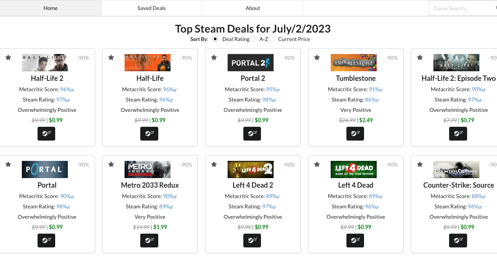
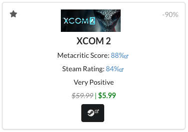
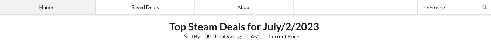

<a name="readme-top"></a>

[![LinkedIn][linkedin-shield]][linkedin-url]

<div align="center">
<p align="center">
    
</p>
<h2 align="center">Top Steam Deals Today</h2>
  <h3 align="center">
    A dynamically updated collection of the best Steam game deals for today,
  </h3>
<h6>Powered by the CheapShark API</h6>
  <p align="right">(<a href="#acknowledgments">See Acknowledgments</a>)</p>

---

</div>

<!-- TABLE OF CONTENTS -->
<details>
  <summary>Table of Contents</summary>
  <ol>
    <li>
      <a href="#getting-started">Getting Started</a>
      <ul>
        <li><a href="#prerequisites">Prerequisites</a></li>
        <li><a href="#installation">Installation</a></li>
        <li><a href="#usage">Usage</a></li>
      </ul>
    </li>
    <li><a href="#contributing">Contributing</a></li>
    <li><a href="#license">License</a></li>
    <li><a href="#contact">Contact</a></li>
    <li><a href="#acknowledgments">Acknowledgments</a></li>
  </ol>
</details>

<!-- ABOUT THE PROJECT -->

## About The Project

<div align="center">

</div>
This is my Phase-2 Project for Flatiron School. In this project, I use a combination of JavaScript, React, HTML, CSS and Semantic-ui to create a single page application. This application dynamically populates cards with Steam Game Sale information provided by the DealShark API. 

---

<br><br>

## Getting Started

When deployed the link to this web app will be as follows:
```
NOT YET DEPLOYED, COMING SOON
```

In any case, to get a local copy up and running follow these steps.

<br>

### Prerequisites

1. This webpage relies on a json-server back-end to save deals as well as sort them.

If you already have json-server, move to step 2, otherwise, please install [json-server](https://www.npmjs.com/package/json-server) by running the following command in your terminal.

- json-server installation

```sh
npm i json-server
```

2. Next, you will need to fork and clone the following repo to provide the initial json structure

```
https://github.com/AldenReyes/phase-2-game-deals-json-server
```
3. From there, you can start up the back-end server with the command

```sh
npm run dev
```

4. With the local server now running you can continue with installation
---

### Installation

1. Clone this repo to a folder on your computer using your method of choice, example using SSH:
   (after navigating to the folder you want to clone to)

```sh
git clone git@github.com:AldenReyes/phase-2-steam-game-deals-finder.git
```
2. From there, navigate to the folder in your terminal and run the shell command
```sh
npm start
```
3. If all goes well the web page should open in your browser and be ready for use, enjoy!

---

### Usage


Each individual card dynamically provides its own game review data, thumbnail, price (in USD), store link (redirect through CheapShark as a condition of use), star to save, and percentage off indicator.



Navigation is provided by the top tabs, with a search bar allowing users to input and then view current steam prices for any game title search. Sorting the collection of cards is achieved with the "Sort by" radio checkboxes.

---

## Contributing

Contributions are what make the open source community such an amazing place to learn, inspire, and create. Any contributions you make are **greatly appreciated**.

If you have a suggestion that would make this better, please fork the repo and create a pull request.

1. Fork the Project
2. Create your Feature Branch (`git checkout -b feature/AmazingFeature`)
3. Commit your Changes (`git commit -m 'Add some AmazingFeature'`)
4. Push to the Branch (`git push origin feature/AmazingFeature`)
5. Open a Pull Request

---

## License

Distributed under the MIT License. See `LICENSE.txt` for more information.

---

## Contact

Alden Reyes - Aldenrey@gmail.com - <a href="https://www.linkedin.com/in/alden-reyes">LinkedIn</a>

Other Project Links: [The Owen Wilson Wow Generator](https://github.com/AldenReyes/phase-1-SPA-Project-Owen-Wilson-Wow-Generator)

---

<a name="acknowledgments"></a>

## Acknowledgments

- [JSON Data - CheapShark API ](https://apidocs.cheapshark.com/)

<p align="right">(<a href="#readme-top">back to top</a>)</p>

<!-- MARKDOWN LINKS & IMAGES -->
<!-- https://www.markdownguide.org/basic-syntax/#reference-style-links -->

[contributors-shield]: https://img.shields.io/github/contributors/github_username/repo_name.svg?style=for-the-badge
[contributors-url]: https://github.com/github_username/repo_name/graphs/contributors
[forks-shield]: https://img.shields.io/github/forks/github_username/repo_name.svg?style=for-the-badge
[forks-url]: https://github.com/github_username/repo_name/network/members
[stars-shield]: https://img.shields.io/github/stars/github_username/repo_name.svg?style=for-the-badge
[stars-url]: https://github.com/github_username/repo_name/stargazers
[issues-shield]: https://img.shields.io/github/issues/github_username/repo_name.svg?style=for-the-badge
[issues-url]: https://github.com/github_username/repo_name/issues
[license-shield]: https://img.shields.io/github/license/github_username/repo_name.svg?style=for-the-badge
[license-url]: https://github.com/AldenReyes/phase-1-SPA-Project-Owen-Wilson-Wow-Generator/blob/main/LICENSE.txt
[linkedin-shield]: https://img.shields.io/badge/-LinkedIn-black.svg?style=for-the-badge&logo=linkedin&colorB=555
[linkedin-url]: https://www.linkedin.com/in/alden-reyes
[webpage-screenshot]: images/screenshot.png
[Next.js]: https://img.shields.io/badge/next.js-000000?style=for-the-badge&logo=nextdotjs&logoColor=white
[Next-url]: https://nextjs.org/
[React.js]: https://img.shields.io/badge/React-20232A?style=for-the-badge&logo=react&logoColor=61DAFB
[React-url]: https://reactjs.org/
[Vue.js]: https://img.shields.io/badge/Vue.js-35495E?style=for-the-badge&logo=vuedotjs&logoColor=4FC08D
[Vue-url]: https://vuejs.org/
[Angular.io]: https://img.shields.io/badge/Angular-DD0031?style=for-the-badge&logo=angular&logoColor=white
[Angular-url]: https://angular.io/
[Svelte.dev]: https://img.shields.io/badge/Svelte-4A4A55?style=for-the-badge&logo=svelte&logoColor=FF3E00
[Svelte-url]: https://svelte.dev/
[Laravel.com]: https://img.shields.io/badge/Laravel-FF2D20?style=for-the-badge&logo=laravel&logoColor=white
[Laravel-url]: https://laravel.com
[Bootstrap.com]: https://img.shields.io/badge/Bootstrap-563D7C?style=for-the-badge&logo=bootstrap&logoColor=white
[Bootstrap-url]: https://getbootstrap.com
[JQuery.com]: https://img.shields.io/badge/jQuery-0769AD?style=for-the-badge&logo=jquery&logoColor=white
[JQuery-url]: https://jquery.com